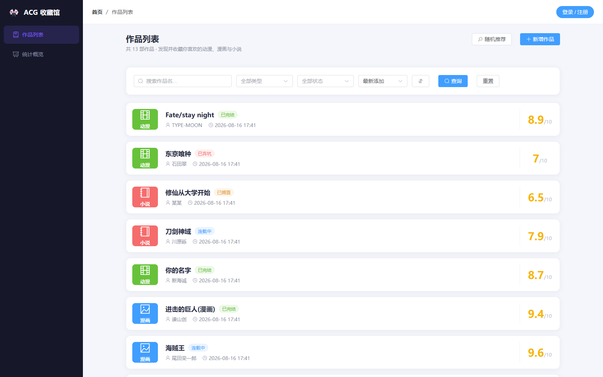
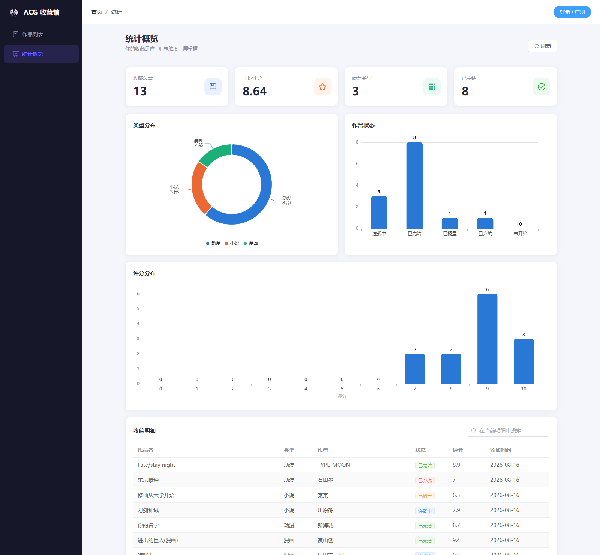
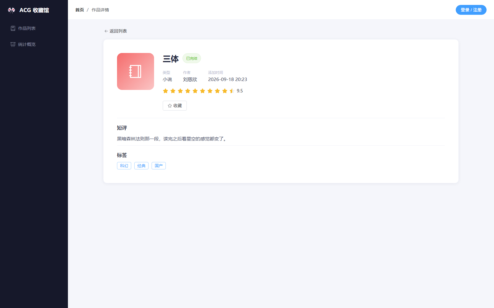
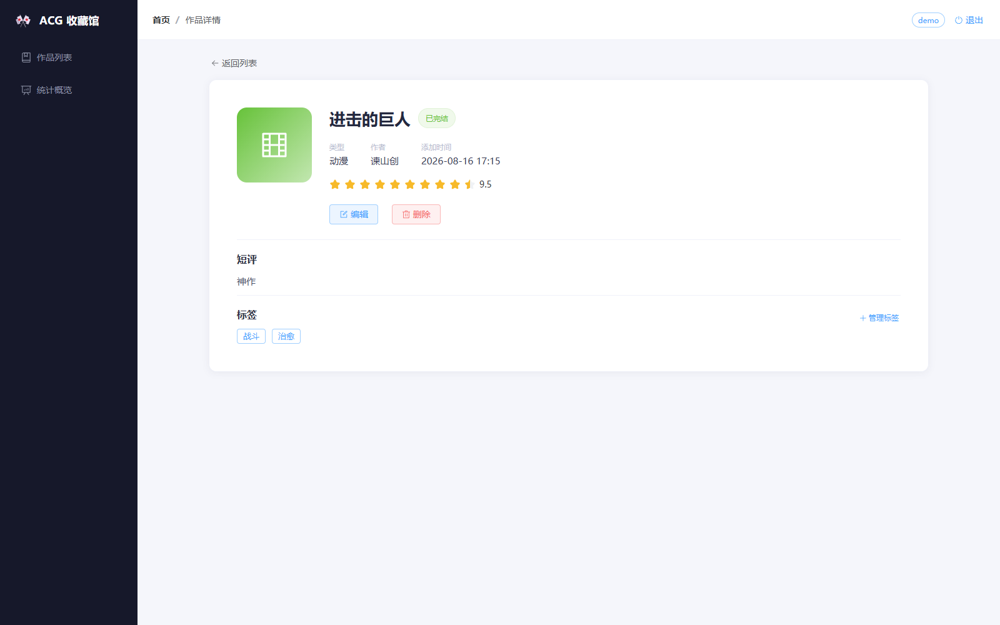
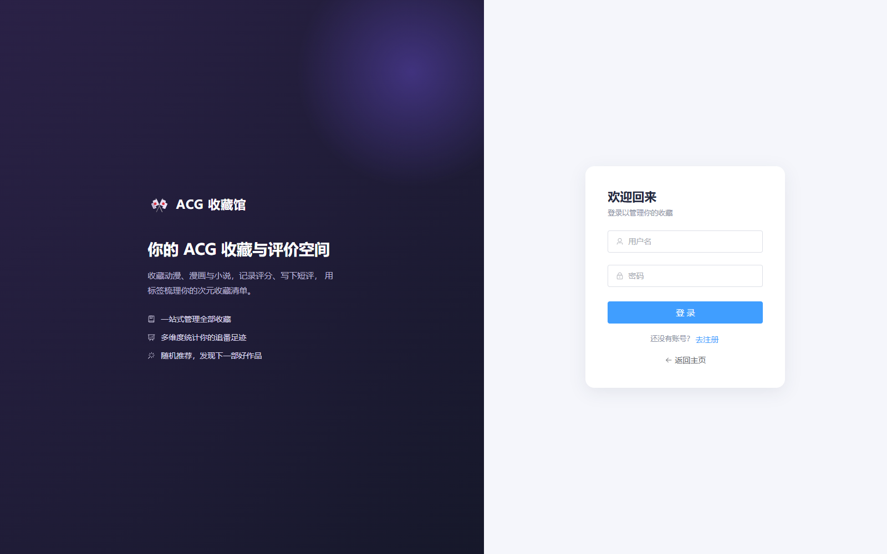

# ACG 收藏馆

动漫 / 漫画 / 小说 / 影视的收藏与评价系统，**前后端全栈实现**：Vue 3 + Element Plus 前端，FastAPI + SQLAlchemy 后端，Redis 作为可选缓存。

支持 JWT 登录、作品增删改查、用户收藏、多对多标签、条件筛选与动态排序、统计图表，共 16 个 REST 接口 + 4 个页面。

---

## 截图

**作品列表** —— 关键词搜索、类型/状态筛选、排序、分页、随机推荐



**统计概览** —— KPI 卡片 + 类型分布 / 作品状态 / 评分分布三张 ECharts 图表 + 明细表



**作品详情** —— 评分星级、短评、标签；登录后展示编辑 / 删除 / 管理标签



**登录后界面** —— 顶部显示当前账号，作品详情页出现管理入口



**登录 / 注册**



---

## 快速开始

前端已构建好并随仓库提交，**不需要装 Node.js，也不需要装 Redis**：

```bash
pip install -r requirements.txt
python run.py
```

打开 <http://127.0.0.1:8000/> 即可。

Windows 用户也可以直接双击 `start.bat`。

| 地址 | 说明 |
|---|---|
| <http://127.0.0.1:8000/> | 网页首页 |
| <http://127.0.0.1:8000/docs> | Swagger 接口文档 |

常用参数：`python run.py --port 9000` 换端口，`--host 0.0.0.0` 允许局域网访问。

> **关于数据**：首次启动会自动在项目根目录创建空的 `acg.db` 并建表。
> 上面的截图是本地录入一批作品后的效果，**演示数据没有随仓库提交** ——
> 你拿到的是干净的库，可以直接在网页上点「新增作品」录入。

---

## 功能特性

**作品管理**
- 作品的增删改查，评分（0–10，前端星值展示）、短评、类型、状态、作者
- 按类型 / 状态 / 标题模糊搜索，支持按 ID / 评分 / 添加时间排序，可升降序、分页
- 随机推荐：从全馆作品中随机抽一部

**收藏**
- 用户与作品多对多（`user_favorites` 关联表 + `(user_id, work_id)` 唯一约束）
- 上传和收藏是两个独立动作：作品上传后即对所有人公开，收藏则是每个用户各自的私有列表
- 列表页可切换「全部作品 / 我的收藏 / 我上传的」三种视角，同一个 `/works` 接口用 `scope` 参数区分
- 收藏与取消收藏接口都做成**幂等**的，前端切换按钮连点不会报错

**标签系统**
- 标签与作品多对多（`work_tags` 关联表 + `(work_id, tag_id)` 唯一约束）
- 支持「按多个标签同时命中」筛选作品（`having count == n`）

**用户系统**
- 注册 / 登录，密码用 bcrypt 加盐哈希存储，绝不落明文
- JWT 签发与校验，受保护接口统一走 `Depends(get_current_user)`
- 公开接口用 `Depends(get_optional_user)`：没登录也能浏览，登录了才额外返回"是否已收藏"

**统计**
- 作品总量、平均评分、覆盖类型数、已完结数
- 类型分布（环形图）、作品状态（柱状图）、评分分布（直方图）
- 统计口径跟随列表的 `scope`，保证分页用的 `total` 和实际返回条数一致

---

## 技术栈

| 层 | 选型 |
|---|---|
| 后端 | Python 3.10+（实测 3.14）、FastAPI、Uvicorn |
| ORM / 数据库 | SQLAlchemy 2.0、SQLite |
| 数据校验 | Pydantic v2 |
| 认证 | bcrypt、python-jose（JWT） |
| 缓存 | Redis（**可选依赖**，见下） |
| 前端 | Vue 3、Vite 5、Vue Router、Pinia |
| UI | Element Plus、ECharts 5 |

依赖版本已在 `requirements.txt` 中精确锁定。

---

## 设计说明

### 1. Redis 是可选依赖，不是硬依赖

缓存属于性能优化，装没装 Redis 跟「项目能不能用」无关。所以缓存调用全部包了降级封装：`cache_get` 失败返回 `None`（等同于未命中，回落到查数据库），`cache_set` / `cache_delete` 失败静默忽略。

这里踩过两个坑，都直接影响可用性：

- **`retry=Retry(NoBackoff(), 0)`** —— redis-py 8.x 默认 `retries=10` 且带指数退避。不关掉的话，Redis 没启动时每个请求要先重试 10 遍，**实测单个请求要等 19 秒**；关掉后降到约 1 秒。
- **熔断** —— 即使加了超时，每个请求仍要付一次连接失败的代价。所以确认 Redis 不可用后，直接置位 `_CACHE_DOWN`，**30 秒内所有缓存调用直接短路返回**，不再尝试连接；冷却期过后放行一次探测，自动恢复。实测后续请求降到 3 毫秒。

另外 `host` 用 `127.0.0.1` 而不是 `localhost`，避免 IPv6(`::1`) 和 IPv4 各连一次。

启动时会打印一行状态，降级行为对使用者是可见的：

```
[缓存] 未检测到 Redis，已自动降级为直连数据库（功能不受影响，仅少了缓存）
```

### 2. 缓存失效放在事务边界之外

`create_work` 里原本把 `r.delete("works_stats")` 写在 `try/except Exception` 块内、`db.commit()` 之后。这样一旦 Redis 抛异常就会被 except 捕获并触发 `db.rollback()` —— 对一个**已经提交**的事务回滚，然后返回 500，而数据其实已经写进去了。

现在缓存失效统一移到事务块之外：数据先落库，缓存删不掉也不影响结果（300 秒 TTL 会兜底一致）。

### 3. API 统一挂在 `/api` 前缀下

前端 axios 的 `baseURL` 是 `/api`，早期后端路由却在根路径，靠 Vite 开发代理的 `rewrite` 把前缀剥掉 —— 这个错配在开发态被代理掩盖，一旦前端由后端直接提供就会全部 404。

现在后端用 `APIRouter(prefix="/api")` 统一挂载，代理的 `rewrite` 也去掉了，**开发态和生产态走同一套 URL**。

### 4. SPA history 路由的 fallback

前端用 `createWebHistory`，直接访问或刷新 `/stats`、`/work/1` 这类前端路由时，服务端并没有对应文件，会 404。所以挂了一个 catch-all 返回 `index.html` 交给前端接管。

`StaticFiles(html=True)` **不能**替代它 —— 那个只在请求目录时生效，对未知路径仍然 404。

catch-all 里显式挡掉 `api` 前缀：否则 `/api/typo` 会返回一段 HTML，前端拿它当 JSON 解析，报错信息会非常难查。现在 `/api/typo` 稳定返回 JSON 404。

### 5. 缺少 token 返回 401 而不是 403

`HTTPBearer(auto_error=True)` 在缺少 `Authorization` 头时由 FastAPI 直接返回 403，而前端只在收到 **401** 时才清 token 跳登录页 —— 403 会走通用错误分支，表现为 token 过期后提示语不对、且停在原地不跳转。

改成 `auto_error=False`，由 `get_current_user` 统一抛 401，两种情况（缺 token / token 无效）前端行为一致，也更符合 HTTP 语义。

### 6. 数据库用绝对路径

`sqlite:///acg.db` 是相对当前工作目录解析的，从别的目录启动会在那边新建一个空库，让人误以为数据丢了。现在基于 `Path(__file__).resolve().parent` 拼绝对路径。

---

## API 接口

所有业务接口都在 `/api` 下，完整文档见 `/docs`。

| 方法 | 路径 | 说明 | 需要认证 |
|---|---|---|---|
| POST | `/api/register` | 注册 | 否 |
| POST | `/api/login` | 登录，返回 JWT | 否 |
| GET | `/api/works` | 作品列表（筛选 / 排序 / 分页 / 三种视角） | 见下方说明 |
| POST | `/api/works` | 新增作品 | 是 |
| GET | `/api/works/{id}` | 作品详情 | 否 |
| PUT | `/api/works/{id}` | 更新作品 | 是 |
| DELETE | `/api/works/{id}` | 删除作品（同时清掉其收藏记录） | 是 |
| POST | `/api/works/{id}/favorite` | 收藏作品（幂等） | 是 |
| DELETE | `/api/works/{id}/favorite` | 取消收藏（幂等） | 是 |
| GET | `/api/works/random` | 随机推荐 | 否 |
| GET | `/api/works/stats` | 统计汇总（口径跟随 `scope`） | 见下方说明 |
| GET | `/api/works/{id}/tags` | 该作品的标签 | 否 |
| POST | `/api/works/{id}/tags` | 给作品加标签 | 是 |
| DELETE | `/api/works/{id}/tags/{tag_id}` | 移除作品上的标签 | 是 |
| GET | `/api/works/tags/by-tags` | 按多个标签筛选作品 | 否 |
| POST | `/api/tags` | 新建标签 | 是 |

列表接口支持的查询参数：`type`、`status`、`title`（模糊匹配）、`scope`、`skip`、`limit`、`sort_by`（`id` / `rating` / `created_at`）、`order`（`asc` / `desc`）。

`scope` 控制看哪一批作品：`all`（默认，全馆公开，**无需登录**）、`favorites`（我的收藏）、`mine`（我上传的）。
后两者属于个人视角，必须带 token，否则返回 401。`/api/works/stats` 接受同样的 `scope`——
统计口径和列表必须一致，否则前端拿 `total` 算出来的页码会和实际条数对不上。

作品是**公开**的：谁都能看到所有人上传的作品，目前不做用户之间的权限隔离
（`works.user_id` 已经记录了上传者，为以后加「只有作者能改/删」留好了位置）。

---

## 目录结构

```
ACG收藏馆/
├── main.py              # 应用入口：14 个路由 + 缓存封装 + 静态文件挂载
├── models.py            # SQLAlchemy 模型（Work / Tag / WorkTag / User）
├── schemas.py           # Pydantic 校验模型
├── database.py          # 引擎与会话
├── auth.py              # 密码哈希、JWT 签发校验、get_current_user
├── run.py               # 一键启动（唯一推荐入口）
├── start.bat / start.sh # 双击 / shell 封装
├── requirements.txt
├── docs/screenshots/    # README 用截图
└── frontend/            # Vue 3 前端
    ├── dist/            # 构建产物（已提交，故无需 Node.js）
    └── src/
        ├── views/       # WorkList / WorkDetail / Stats / Login
        ├── api/         # axios 封装（自动带 JWT、401 跳登录）
        ├── stores/      # Pinia
        └── utils/       # ECharts 按需引入
```

---

## 开发模式

改前端需要热更新时，另开一个终端跑 Vite，两个进程配合：

```bash
# 终端 1 —— 后端
uvicorn main:app --reload --port 8000

# 终端 2 —— 前端
cd frontend
npm install
npm run dev        # http://localhost:5173
```

Vite 已配好把 `/api` 代理到 `localhost:8000`（不再 rewrite 前缀）。改完前端要重新构建，产物才会反映到 `python run.py` 的单端口模式：

```bash
cd frontend && npm run build
```

---

## 已知限制

诚实列一下当前没做的事，都是有意取舍而非疏漏：

- **`SECRET_KEY` 硬编码在 `auth.py`** —— 本地项目够用，真要部署应该走环境变量。
- **没有数据库迁移工具** —— 用 `Base.metadata.create_all()` 建表，字段变更需手工处理。生产环境该上 Alembic。
- **SQLite 单文件** —— 适合单机与演示，没做并发写入优化。
- **缓存不是强一致** —— 主动删除 + 300 秒 TTL 兜底，不是事务级一致。
- **没有自动化测试** —— 目前所有验证都是手工跑的。
